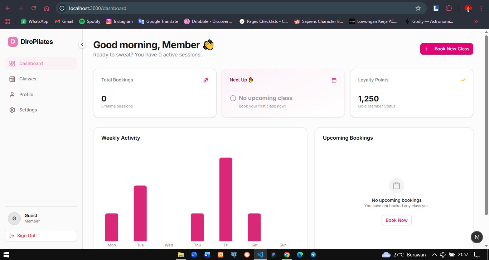
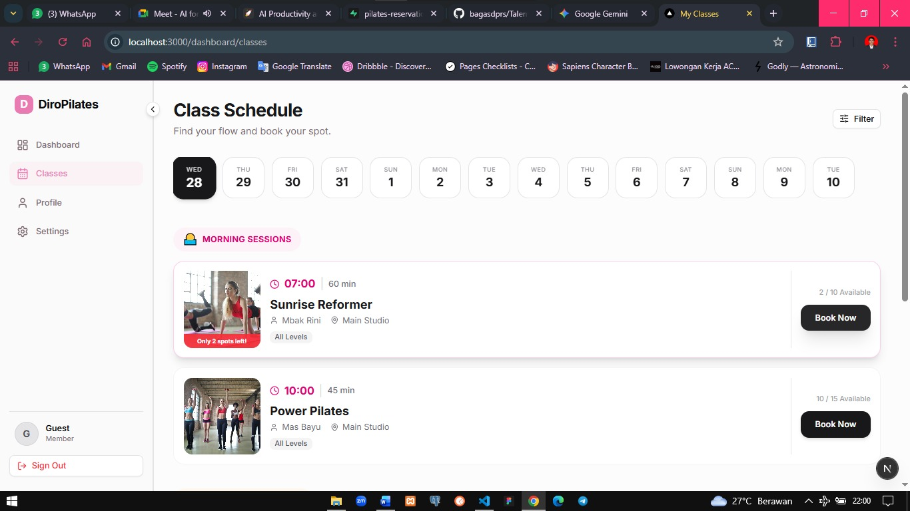
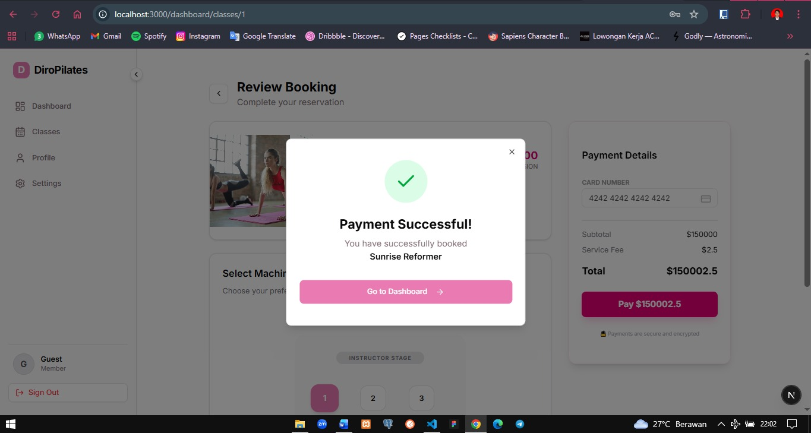
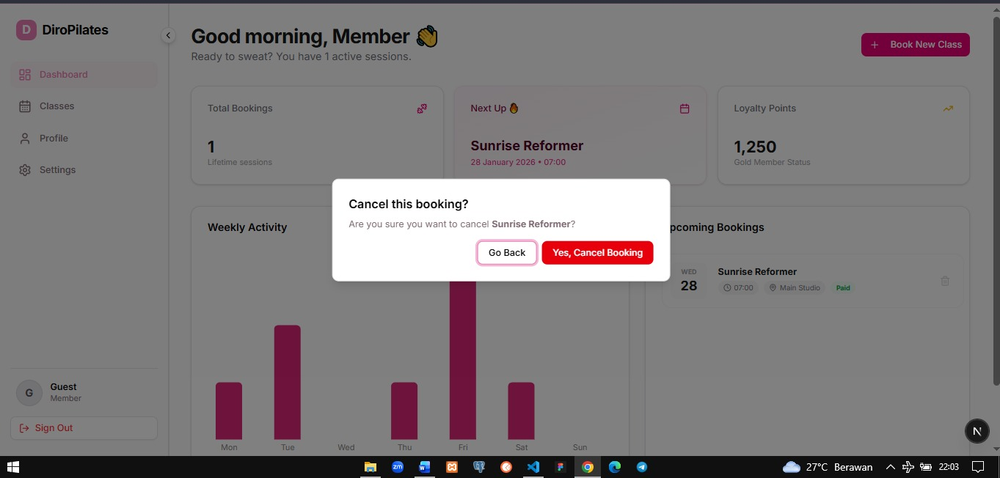

# 🧘‍♂️ Pilates Reservation App (Fullstack)

> **Technical Assessment for DIRO App** > A high-performance booking platform built with **Next.js 15** and **Golang (Clean Architecture)**.


---

## 🖼️ Gallery & Features

|           **Interactive Dashboard**           |           **Real-time Booking**           |
| :-------------------------------------------: | :---------------------------------------: |
|  |  |
| _View stats, upcoming classes, and history._  |  _Select Date, Time, and Specific Spot._  |

|          **Payment Integration**           |            **Cancellation Flow**             |
| :----------------------------------------: | :------------------------------------------: |
|           |       |
| _Seamless payment simulation (QRIS/Card)._ | _Secure cancellation with slot restoration._ |

---

## 🚀 Overview

This project serves as a comprehensive solution for a Pilates Studio reservation system. Unlike typical CRUD apps, this project implements **Double-Booking Protection**, **Concurrency Handling**, and a robust **Clean Architecture** on the backend to ensure scalability.

### ✨ Key Features Implemented

- **📅 Smart Scheduling:** Users can browse classes by date. Slots are updated in real-time.
- **🧘 Spot Selection:** Interactive UI to choose specific Reformer machines/spots.
- **💳 Payment Gateway (Bonus):** Integrated payment simulation flow before booking confirmation.
- **❌ Cancellation System:** Users can cancel bookings, automatically restoring the class quota.
- **📊 User Dashboard:** Personalized dashboard showing activity stats, upcoming classes, and booking history.

---

## 🛠️ Tech Stack & Architecture

### **Backend (Golang)**

Built with **Gin Gonic**, following strictly **Clean Architecture** principles to separate concerns:

- **Handler Layer:** Manages HTTP Requests/Responses.
- **Service Layer:** Contains Business Logic (Validation, Quota Checks).
- **Repository Layer:** Direct Database Interactions (GORM/SQL).
- **Database:** PostgreSQL (Hosted on Supabase).

### **Frontend (Next.js)**

- **Framework:** Next.js 16.1.6 (App Router).
- **Styling:** Tailwind CSS v4 + Shadcn UI.
- **State Management:** React Hooks + Server Actions.
- **Visualization:** Recharts for user activity data.

---

## 📂 Project Structure

```bash
NEXT-PILATES-RESERVATION/
├── assets/
│   ├── booking_pilates.jpeg
│   ├── cancel_booking.jpeg
│   ├── dashboard_pilates.jpeg
│   └── payment.jpeg
├── backend/
│   ├── cmd/
│   │   └── api/
│   │       └── main.go
│   ├── go.mod
│   ├── go.sum
│   └── internal/
│       ├── config/
│       ├── entity/
│       │   └── entity.go
│       ├── handler/
│       │   ├── booking.go
│       │   └── profile_handler.go
│       ├── repository/
│       │   └── profile_repo.go
│       └── service/
│           └── profile_service.go
├── frontend/
│   ├── app/
│   │   ├── dashboard/
│   │   │   ├── classes/
│   │   │   │   ├── layout.tsx
│   │   │   │   ├── page.tsx
│   │   │   │   └── [classId]/
│   │   │   │       └── page.tsx
│   │   │   ├── layout.tsx
│   │   │   ├── page.tsx
│   │   │   ├── profile/
│   │   │   │   ├── layout.tsx
│   │   │   │   └── page.tsx
│   │   │   └── settings/
│   │   │       ├── layout.tsx
│   │   │       └── page.tsx
│   │   ├── favicon.ico
│   │   ├── globals.css
│   │   ├── layout.tsx
│   │   ├── login/
│   │   │   ├── layout.tsx
│   │   │   └── page.tsx
│   │   ├── page.tsx
│   │   └── register/
│   │       ├── layout.tsx
│   │       └── page.tsx
│   ├── components/
│   │   ├── classes/
│   │   │   ├── ClassCard.tsx
│   │   │   ├── DateSelector.tsx
│   │   │   ├── PaymentWizard.tsx
│   │   │   └── SpotSelector.tsx
│   │   ├── layouts/
│   │   │   ├── MobileSidebar.tsx
│   │   │   └── Sidebar.tsx
│   │   ├── PageTransition.tsx
│   │   ├── settings-view/
│   │   │   ├── AccountTab.tsx
│   │   │   ├── BillingTab.tsx
│   │   │   └── NotificationsTab.tsx
│   │   └── ui/
│   │       ├── alert-dialog.tsx
│   │       ├── badge.tsx
│   │       ├── button.tsx
│   │       ├── calendar.tsx
│   │       ├── card.tsx
│   │       ├── dialog.tsx
│   │       ├── form.tsx
│   │       ├── input.tsx
│   │       ├── label.tsx
│   │       ├── popover.tsx
│   │       ├── progress.tsx
│   │       ├── select.tsx
│   │       ├── separator.tsx
│   │       ├── sheet.tsx
│   │       ├── sonner.tsx
│   │       ├── switch.tsx
│   │       ├── table.tsx
│   │       ├── tabs.tsx
│   │       └── textarea.tsx
│   ├── components.json
│   ├── eslint.config.mjs
│   ├── lib/
│   │   └── utils.ts
│   ├── next-env.d.ts
│   ├── next.config.ts
│   ├── package-lock.json
│   ├── package.json
│   ├── postcss.config.mjs
│   ├── public/
│   │   ├── file.svg
│   │   ├── globe.svg
│   │   ├── next.svg
│   │   ├── vercel.svg
│   │   └── window.svg
│   ├── README.md
│   └── tsconfig.json
├── LICENSE
└── README.md

```

## ⚙️ How to Run Locally

Follow these steps to set up the project on your local machine.

### Clone the repository

```bash
git clone https://github.com/bagasdprs/Pilates-Reservation.git
cd next-pilates-reservation
```

### Backend Setup (Golang)

```bash
cd backend

# Create .env file
# (Copy the provided .env.example content or use your Supabase credentials)
touch .env

# Install Dependencies
go mod tidy

# Run the Server
go run cmd/api/main.go
```

_Backend will run on:`http://localhost:8080`_

### Frontend Setup (Next.js)

Open a new terminal.

```bash
cd frontend

# Install Dependencies
npm install

# Run the Development Server
npm run dev
```

_Frontend will run on:`http://localhost:3000`_

## 🧪 API Endpoints

| Method   | Endpoint                 | Description                   |
| :------- | :----------------------- | :---------------------------- |
| `GET`    | `/api/classes`           | Get list of available classes |
| `GET`    | `/api/schedules`         | Get schedules by date         |
| `POST`   | `/api/bookings`          | Create a new booking          |
| `GET`    | `/api/bookings/user/:id` | Get user's booking history    |
| `DELETE` | `/api/bookings/:id`      | Cancel a booking              |
| `GET`    | `/api/profile/:id`       | Get user profile details      |

## 📜 LICENSE

This project is licensed under the MIT License

Note for Reviewers: This code is submitted specifically for the DIRO App Technical Assessment.

---

<div align="center">
  <br/>
  <p>
    Developed with ❤️ and ☕ by <b><a href="https://github.com/bagasdprs">Bagas Dwiprasandi</a></b>
  </p>
  <p>
    🚀 <i>Submitted for DIRO App Technical Assessment</i> 🚀
  </p>
  <p>
    &copy; 2026 • All Rights Reserved
  </p>
</div>
